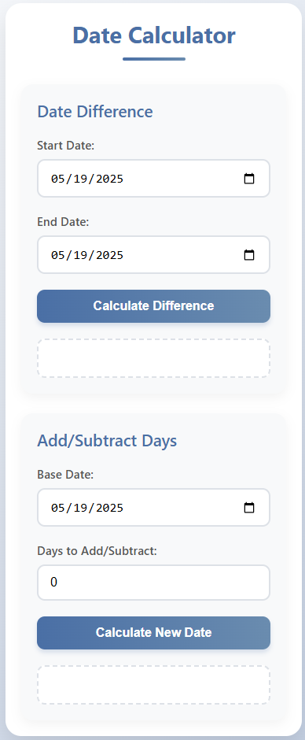

# Date Calculator

A clean, modern web application that helps users perform date-related calculations with an intuitive interface.

[](https://year-calculator-two.vercel.app/)


## Features

- **Date Difference Calculator**: Calculate the exact number of days between two dates
- **Date Addition/Subtraction**: Add or subtract days from a specific date to find a new date
- **Responsive Design**: Works seamlessly on desktop and mobile devices
- **Modern UI**: Clean, intuitive interface with visual feedback
- **Instant Results**: Real-time calculations without page reloads
- **Accessible**: Built with accessibility best practices

## Technologies Used

- HTML5 (semantic markup)
- CSS3 (Flexbox, CSS Grid, custom properties, animations)
- Vanilla JavaScript (ES6+ features)
- Date-fns library (for comprehensive date operations)

## Live Demo

Experience the application live:  
👉 [https://year-calculator-two.vercel.app/](https://year-calculator-two.vercel.app/)

## Installation & Usage

This application doesn't require any build tools or package installations. Simply download the files and open in a browser:

```bash
# Clone the repository
git clone https://github.com/your-username/year-calculator.git

# Navigate to project directory
cd year-calculator

# Open in browser (or just double-click index.html)
